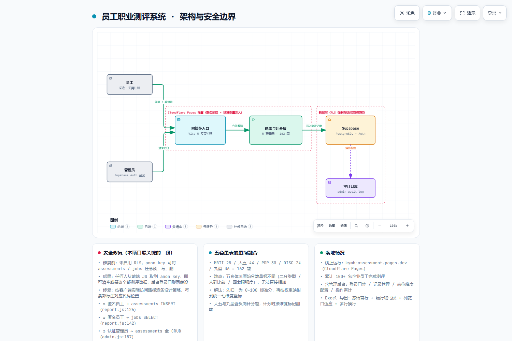

# 员工职业测评系统 · Career Assessment

> 一套 **5 合 1 的企业级员工职业测评平台**：MBTI + 大五人格 + PDP + DISC + 九型人格，共 **162 题**，
> 一次作答产出跨体系报告，含管理后台与操作审计。
> 部署于 Cloudflare Pages，数据层 Supabase（PostgreSQL + Auth + RLS）。

**已上线运行**（企业内网部署，支持现场演示） · 累计 **100+ 名企业员工**完成测评

---

## 一、这个系统解决什么

公司原计划外部采购同类测评系统。我独立完成了从需求设计到上线的全流程，用自研方案替代了这笔采购。

它需要同时满足两类人的需求：

| 角色 | 需求 | 对应入口 |
|---|---|---|
| **员工** | 匿名答题，不注册、不登录，答完立刻看报告 | `assess.html` → `result.html` |
| **管理员** | 登录后台，看记录、配岗位维度、看审计日志 | `admin.html` |

难点在于：**员工必须能匿名写入，但绝不能读到别人的数据**。这个边界是本项目最值得讲的部分。

---

## 二、架构



> 可缩放 / 可导出 SVG 的交互版本：[`docs/architecture.html`](docs/architecture.html)
> 图源规格：[`docs/architecture.json`](docs/architecture.json)

---

## 三、最关键的一段：RLS 安全修复

**这个项目最初有一个真实的严重漏洞，我把它修了。这是整个仓库里最值得看的一段。**

### 问题

系统早期**未启用 Supabase RLS（行级安全）**。Supabase 的 `anon` key 是公开的——它会被打包进前端 JS，
任何人打开浏览器开发者工具就能拿到。而没有 RLS 时，这个 key 的权限是**整表任意读写删**。

后果很具体：

- 任何人拿到 anon key，可以 `DELETE FROM assessments` —— **清空全部测评数据**
- 也可以 `UPDATE` —— **篡改任何人的测评结果**
- 后台的登录门**形同虚设**，因为攻击者根本不用走后端

### 修复思路

关键不是"把权限收紧"，而是**把权限精确对应到真实的访问路径**。见 [`supabase_rls_policies.sql`](supabase_rls_policies.sql)：

```sql
-- ① 匿名员工 → assessments INSERT（对应 report.js:126）
--    用 public 角色而非单列 anon，避免管理员本人答题时被拒
CREATE POLICY "submit_assessments"
  ON assessments FOR INSERT TO public WITH CHECK (true);

-- ③ 读取测评记录 → 仅认证管理员（这是本次修复关闭的核心漏洞）
CREATE POLICY "admin_read_assessments"
  ON assessments FOR SELECT TO authenticated USING (true);
```

完整五条策略，每条都在注释里标注了**对应的代码位置**：

| # | 主体 | 表 | 操作 | 对应代码 |
|:---:|---|---|---|---|
| ① | 匿名员工 | `assessments` | INSERT | `report.js:126` |
| ② | 匿名员工 | `jobs` | SELECT | `report.js:142` |
| ③ | 认证管理员 | `assessments` | 全 CRUD | `admin.js:187` |
| ④ | 认证管理员 | `jobs` | 全 CRUD | `admin.js:356/602` |
| ⑤ | 认证管理员 | `admin_audit_log` | SELECT + INSERT | `store.js:52` |

**为什么标注代码行号**：策略是死的，访问路径是活的。改了前端调用不懂策略、改了策略不懂前端调用，
都会出线上故障（要么功能挂、要么权限漏）。把两边钉在一起，改代码时能立刻看到该动哪条策略。

### 踩过的一个坑

第一条策略用的是 `TO public` 而不是 `TO anon`。原因：管理员本人也会答题，
如果只给 `anon` 角色 INSERT 权限，管理员登录后（角色变成 `authenticated`）反而提交不了。
这是一个只有真跑过才会发现的问题。

---

## 四、五套量表的量纲融合

这是业务上最核心的技术难点。

**五套体系的原始分数量纲完全不同**：

| 体系 | 题数 | 输出形态 |
|---|---:|---|
| MBTI | 28 | 二分类型（如 INTJ） |
| 大五人格 | 44 | 人群比较（百分位） |
| PDP | 30 | 动物类型 + 强度 |
| DISC | 24 | 四象限强度 |
| 九型人格 | 36 | 类型 + 侧翼 + 健康层级 |

直接相加没有意义——一个是分类变量，一个是百分位，一个是强度值。

**解法是两段式**：

```
原始分 → ① 归一层 → 0–100 标准分 → ② 加权映射 → 统一七维度坐标
```

归一化到同一尺度后，才能按权重投影到统一的七维度空间，
使"MBTI 的这个倾向"和"九型的那个人格"可以在同一张图上比较、叠加。

**另一个细节**：大五人格与九型人格含**反向计分题**，计分时必须按维度标记翻转，
否则某些维度会系统性偏移。

---

## 五、技术栈与结构

| 层 | 技术 |
|---|---|
| 前端 | Vite 5 多页构建 + Vanilla JS + Chart.js |
| 数据层 | Supabase（PostgreSQL + Auth + **RLS**） |
| 导出 | ExcelJS（冻结首行 / 隔行斑马纹 / 列宽自适应 / 多行换行） |
| 部署 | Cloudflare Pages |
| 测试 | 23 项功能测试脚本 + 报告质量回归 |

```
kangyuan-career-assessment/
├── index.html            # 首页
├── assess.html           # 答题（162 题）
├── result.html           # 结果报告（雷达图 + 维度解读 + 岗位匹配度）
├── admin.html            # 管理后台（登录门禁 / 记录管理 / 岗位配置 / 审计）
├── reset.html            # 重置
├── recover.html          # 恢复
├── src/
│   ├── data/             # 五套量表题库 + 岗位画像
│   │   ├── questions.js      # 162 题主库
│   │   ├── mbtiLibrary.js  big5Library.js  discLibrary.js
│   │   ├── pdpLibrary.js   enneagramLibrary.js
│   │   └── defaultJobs.js
│   ├── lib/              # 计分 / 归一化 / 存储
│   └── pages/
├── supabase_rls_policies.sql   # ← 安全策略（含代码位置溯源）
└── 使用说明操作手册.md
```

---

## 六、本地运行

```bash
npm install
cp .env.example .env       # 填入自己的 Supabase URL 与 anon key
npm run dev                # → http://localhost:5173

# 数据库：在 Supabase Dashboard → SQL Editor 执行
# supabase_rls_policies.sql   ← 必须执行，否则数据无保护
```

## 七、已知边界（诚实写在这里）

1. **量表本身未经本地常模与信效度检验**。用的是成熟的公开量表，
   但没有做本土化常模和 Cronbach α 检验，所以**结果用于参考而非人事决策依据**。
2. **岗位匹配度公式是经验权重**，没有用历史数据做过拟合验证。
3. **没有自动化端到端测试**。目前是脚本化的功能回归 + 人工核对，
   缺少 CI 化的 E2E 覆盖。
4. **报告生成全部在前端**，意味着计分逻辑对用户可见。
   如果要做防作弊，需要把计分下沉到服务端（Supabase Edge Function）。
5. 单租户设计，**不支持多企业隔离**。

---

## License

MIT
